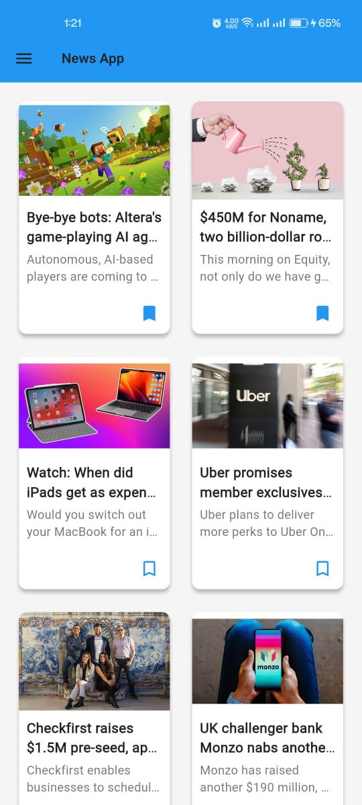
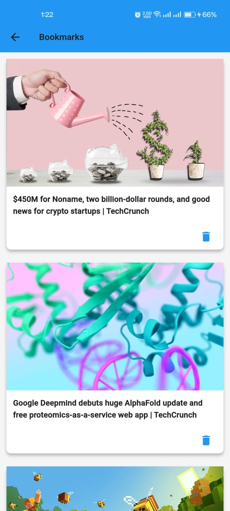
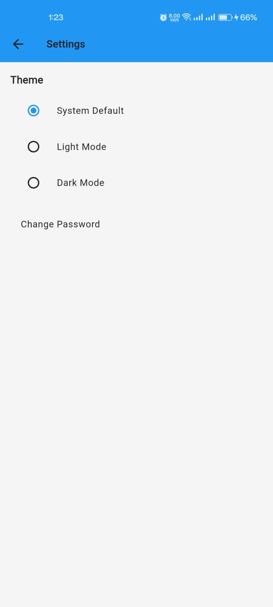

# Newspaper App 📰

A Flutter-based mobile application that allows users to read and interact with the latest news articles. The app includes features like article details, bookmarking, offline caching, and social sharing.

---

## 🚀 Features

- ✅ Display a list of top headlines from **TechCrunch**.
- ✅ View full **article details**, including:
  - Headline
  - Image
  - Full text (scraped using HTML parsing)
  - Author, date, and source information
- ✅ Bookmark favorite articles for later reading.
- ✅ Store bookmarked articles in both **Firebase Cloud Firestore** and **Hive (local storage)** for seamless synchronization.
- ✅ Support for **offline reading** via local cache.
- ✅ Share articles on **Facebook, Twitter, and WhatsApp**.
- ✅ Customizable **text size** for accessibility.
- ✅ Clean Architecture pattern for **modular code structure**.
- ✅ Authentication using **Firebase Auth** with **Google Sign-In** and **Email/Password login**.
- ✅ Rich UI with **Material Design**, **dynamic theming**, and responsive layout.

---

## 🧱 Architecture Overview

The project is structured according to **Clean Architecture principles**, ensuring separation of concerns between:

| Layer | Description |
|-------|-------------|
| **Domain** | Contains business logic, entities, use cases, and repository interfaces. |
| **Data** | Implements data sources (remote and local), repositories, and network clients. |
| **Presentation** | Handles UI rendering, state management, and user interactions. |

This ensures the app is **scalable**, **testable**, and **maintainable**.

---

## 🛠️ Technologies & Libraries Used

### 📦 Dart & Flutter

- **Flutter**: Cross-platform UI framework.
- **Dart**: Programming language used to build the app.

### 🔐 Firebase Integration

- **Firebase Auth**: For user authentication (Google Sign-In and Email/Password).
- **Cloud Firestore**: For storing user bookmarks remotely.

### 🧩 State Management

- **GetX**: For dependency injection and reactive state management.
  - `Get.find()`: Dependency lookup.
  - `Get.toNamed()`: Navigation.
  - `Rx` and `.obs`: Reactive variables for real-time updates.

### 🌐 Networking

- **Dio**: HTTP client for fetching news data from API.
- **CachedNetworkImage**: Efficient image loading and caching.
- **Html Parser**: Parses raw HTML content from article URLs.
- **flutter_widget_from_html**: Renders parsed HTML as widgets in Flutter.

### 💾 Offline Storage

- **Hive**: Lightweight and fast key-value store for local caching and bookmarking.
  - Used for storing articles locally when offline or as backup for bookmarks.
  - Provides persistence across app sessions.

### 📬 Social Sharing

- **Share Plus**: Allows sharing articles on social platforms like Facebook, Twitter, and WhatsApp.

### 🎨 UI Enhancements

- **Flutter ScreenUtil**: Helps in making responsive UIs based on screen sizes.
- **Flutter Theme Manager**: Supports dynamic dark/light theme switching.
- **Custom Widgets**: Tailored UI components for better user experience.

---

## 📁 Project Structure

```
lib/
├── app/
│   ├── feature/
│   │   ├── auth/
│   │   │   ├── domain/
│   │   │   │   ├── entities/
│   │   │   │   └── usecases/
│   │   │   ├── data/
│   │   │   │   ├── datasources/
│   │   │   │   └── repositories/
│   │   │   └── presentation/
│   │   │       ├── controllers/
│   │   │       └── screens/
│   │   │
│   │   ├── home/
│   │   │   ├── domain/
│   │   │   │   ├── entities/
│   │   │   │   └── usecases/
│   │   │   ├── data/
│   │   │   │   ├── datasources/
│   │   │   │   └── repositories/
│   │   │   └── presentation/
│   │   │       ├── controllers/
│   │   │       └── screens/
│   │   │
│   │   └── bookmark/
│   │       ├── domain/
│   │       │   ├── entities/
│   │       │   └── usecases/
│   │       ├── data/
│   │       │   ├── datasources/
│   │       │   └── repositories/
│   │       └── presentation/
│   │           ├── controllers/
│   │           └── screens/
│   │
│   ├── core/
│   │   ├── network/
│   │   │   ├── api_client.dart
│   │   │   └── dio_config.dart
│   │   ├── utils/
│   │   │   ├── hive_cache_manager.dart
│   │   │   └── helper_methods.dart
│   │   └── theme/
│   │       └── color.dart
│   │
│   └── config/
│       └── router/
│           ├── all_routes.dart
│           └── navigation_service.dart
│
└── main.dart
```

---

## 📲 Screenshots

  
*Home screen showing top headlines*

  
*Article details page with scraped content and share options*

  
*Bookmark screen displaying saved articles*

  
*Settings screen for Theme and other preferences*

---

## 🧪 How It Works

1. **Fetching Articles**:
   - Uses `Dio` to fetch news data from an external API (e.g., NewsAPI).
   - Data is stored in memory and also cached in Hive for offline access.

2. **Displaying Article Details**:
   - When a user selects an article, the app uses `ArticleScraper` to fetch the full HTML content from the article's URL.
   - Scraped content is displayed using `flutter_widget_from_html`.

3. **Bookmarking**:
   - Users can bookmark articles using the **delete icon**.
   - Bookmarks are saved in both **Firebase** and **Hive** for redundancy and synchronization.

4. **Offline Support**:
   - If there’s no internet connection, the app loads previously fetched articles from **Hive**.

5. **Authentication**:
   - User can sign in using **Google Sign-In** or **Email/Password**.
   - After signing in, users can bookmark articles and sync across devices via Firebase.

6. **Sharing**:
   - Articles can be shared on **Facebook, Twitter, and WhatsApp** using the **Share Plus plugin**.

7. **Text Size Adjustment**:
   - A dialog lets users adjust the **text size** for better readability.

---

## 📝 How to Use

### 🔹 Prerequisites

Before running the app, make sure you have the following set up:

- **Flutter SDK**
- **Android Studio / VS Code**
- **Emulator or Android/iOS device**

### 🔹 Setup Instructions

1. Clone the repository:
   ```bash
   git clone https://github.com/AAShayon/newspaper_app.git
   cd newspaper_app
   ```

2. Install dependencies:
   ```bash
   flutter pub get
   ```

3. Initialize Hive:
   ```dart
   await Hive.initFlutter();
   await Hive.openBox('api_cache');
   ```

4. Set up Firebase:
   - Add your own Firebase configuration (`google-services.json` for Android).
   - Replace the placeholder API key in `api_urls.dart` with your actual NewsAPI key.

5. Run the app:
   ```bash
   flutter run
   ```

---

## 📦 Packages Used

Here are the packages used in this project along with their purposes:

| Package | Purpose |
|---------|---------|
| `dio` | For making HTTP requests to fetch articles from the API. |
| `html` | To parse HTML content from article URLs. |
| `flutter_widget_from_html` | Renders HTML content as Flutter widgets. |
| `cached_network_image` | Loads and caches images efficiently. |
| `hive` | Local storage solution for caching and bookmarking. |
| `hive_flutter` | Initializes Hive for Flutter apps. |
| `get` | For dependency injection and state management. |
| `share_plus` | Enables sharing articles on social media platforms. |
| `connectivity_plus` | Checks for internet connectivity. |
| `flutter_screenutil` | Makes UI responsive across different screen sizes. |
| `dartz` | Used for error handling with Either types. |
| `equatable` | Helps in comparing objects for equality. |
| `cloud_firestore` | Remote database for syncing bookmarks across devices. |
| `firebase_auth` | Manages user authentication via Google and email/password. |
| `google_sign_in` | Enables Google Sign-In functionality. |

---

## 🛠️ Installation

To install the required dependencies, add these lines to your `pubspec.yaml` file:

```yaml
dependencies:
  flutter:
    sdk: flutter
  dio: ^5.0.3
  html: ^0.15.0
  flutter_widget_from_html: ^0.16.0
  cached_network_image: ^3.2.0
  hive: ^2.0.4
  hive_flutter: ^1.1.0
  get: ^4.6.5
  share_plus: ^6.7.0
  connectivity_plus: ^6.0.0
  flutter_screenutil: ^5.0.1
  dartz: ^0.10.1
  equatable: ^2.0.3
  cloud_firestore: ^3.3.9
  firebase_auth: ^4.6.0
  google_sign_in: ^5.6.0
```

Then run:

```bash
flutter pub get
```

---

## 📥 APK Download

You can download the working APK from [here](https://drive.google.com/drive/folders/1tnezHqW4LRDlBoeEfxjTYD5IgxZGuZFe?usp=sharing).


## 📌 Future Improvements

- ✅ Add pagination for infinite scrolling of articles.
- ✅ Integrate a search bar to find specific articles.
- ✅ Implement notification system for new articles.
- ✅ Allow saving favorite articles to a "Read Later" section.
- ✅ Add more themes and font customization options.
- ✅ Implement unit and widget tests for robustness.

---

## 🧑‍💻 Contributors

- **Author**: MD ASIF AFROJ  
- **Contact**: shayon.asif@gmail.com  

---

## 📞 Contact

For questions or support, feel free to reach out at:
- **shayon.asif@gmail.com**

---

## 📄 License

This project is open-source and available under the **MIT License**.

---

## 📁 Folder Structure Explanation

| Folder | Description |
|--------|-------------|
| `domain/` | Business logic layer – contains use cases and entities. |
| `data/` | Implementation of data sources and repositories. |
| `presentation/` | UI-related files, controllers, and views. |
| `core/` | Common utilities such as API client, helpers, and theme manager. |
| `config/` | Configuration files for routing and navigation. |

---

## 🧪 Testing

You can test the following scenarios:

1. **Online Mode**:
   - Fetches fresh data from API.
   - Displays full article content after scraping.

2. **Offline Mode**:
   - Loads previously cached articles from Hive.
   - Shares articles without internet by using local copies.

3. **Authentication**:
   - Signs in with Google or email/password.
   - Logs out and clears session data.

4. **Caching**:
   - Caches articles during online mode.
   - Clears cache manually or automatically after expiry.

5. **Bookmarking**:
   - Adds/removes bookmarks dynamically.
   - Syncs bookmarks between Firebase and Hive.

---

## 🧼 Code Quality

- All code is well-documented and follows best practices.
- Uses clean architecture to separate layers and reduce coupling.
- Follows Material Design guidelines for a consistent look and feel.
- Includes proper error handling and fallback states for poor connections.

---

## 🧩 Key Highlights

- **HTML Scraping**: Extracts full article content from external URLs.
- **Dual Caching**: Uses both Hive and Firebase for reliability and offline support.
- **User-Friendly UI**: Easy-to-use interface with smooth transitions and adaptive layouts.
- **Social Sharing**: Allows quick sharing of articles to major platforms.
- **Responsive Text**: Adjusts text size for better readability.

---

## 📁 Repository Contents

| File/Folder | Description |
|-------------|-------------|
| `main.dart` | Entry point of the app. |
| `auth/` | Authentication logic using Firebase. |
| `home/` | Home screen and article listing logic. |
| `bookmark/` | Bookmarking logic with remote and local storage. |
| `core/network/api_client.dart` | Wrapper around Dio for API calls. |
| `core/utils/hive_cache_manager.dart` | Manages caching using Hive. |
| `core/theme/color.dart` | Theme colors and styles. |
| `config/router/all_routes.dart` | Routes and navigation setup. |
| `config/router/navigation_service.dart` | Helper for navigating between screens. |

---

## 📝 Conclusion

This app demonstrates how to build a modern, scalable, and user-friendly news reader using **Flutter + GetX + Firebase + Hive**. It supports **online/offline modes**, **caching**, **authentication**, and **customization**, providing a complete end-to-end solution for news consumption.

---

Thank you for reviewing my project! Let me know if you'd like any further improvements or documentation.
